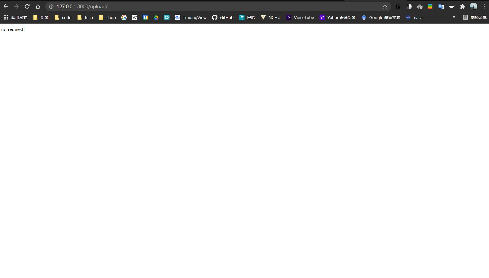

# steelpredict

### django for steelpredict project
____

#### installation  
```
git clone https://github.com/jemmy9211/steelpredict.git
```

#### local site must have python,django environment  
after clone this project,cd into steelpredict  
and enter the following command in terminal  

```
python manage.py runserver
```
*** server would run at http://127.0.0.1:8000/ 


因為看不太懂模型檔案的結構，因此還沒將模型的檔案導入XD  
但request and respone 的功能都寫好了  
應該加入模型預測結果就能完成了  

* update 2021/7/21 8:27 已經將module.py導入steels folder裡的view.py  
* 如果cuda等環境建置好應該就能順利run起來  
